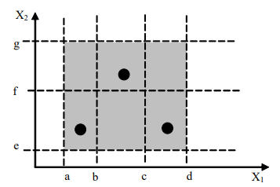

## 第05章 功能性测试

### 一、概述

功能性测试包括如下三种测试：

- 边界值测试
- 等价类测试
- 基于决策表的测试

这三类都是黑盒测试，不需要看源代码，只需要看输入、输出、从功能开始分析。会把功能分为一个一个用例来测试，并且补充用例说明，有完整的输入、输出信息，用来评判输出的正确性。不同的测试方法有优点也有缺点。

### 二、边界测试

对于函数$Y=f(x_1,x_2)$,要求$a\leq x_1 \leq b$，$c\leq x_2 \leq d$， 边界值测试的取值：最小值、略高于最小值、正常值、略高于最高值、最高值。因为边界测试在定义的时候就是基于单缺陷假设。

#### 1）单缺陷假设

**单缺陷假设**：失效很少情况是由两个或者更多的缺陷同时引起的，大多数情况只是一个因素引起。公式：$N$个变量的测试用例的数量：$4N+1$

#### 2）健壮性测试

**健壮性测试**：除了五个边界值，我们再增加一个略小于最小值、一个略大于最大值（即要**考虑无效值**输入）

公式：N个变量的测试用例的数量：$6N+1$

#### 3）最坏情况

**最坏情况测试：**拒绝单缺陷假设，  考虑全部边界输入的组合。N个变量的测试用例：$5^N$(每个变量都要考虑：最小值、略高于最小值、正常值、略高于最高值、最高值，也就是每个变量都是五个情况)加入

- 假如还要考虑健壮性，需要考虑无效数据的输入，那就需要$7^N$的输入。
- 例如：三角形问题边界值测试，abc三个变量，一般法$4\times 3 + 1=13$，最坏情况$5^3=125$个

#### 4）随机测试

**随机测试：**即便完成所有边界值测试，还可以用随机测试，用随机函数取出测试值，但是需要考虑随机生成的数据量

### 三、等价类测试

划分：互不相交的一组子集，这些子集的并集是全集。

#### 1）弱（单缺陷）一般等价类

- 对于函数$Y=f(x_1,x_2)$，
- $a\leq x_1 \leq d$，等价区间：$[a,b), [b,c), [c,d], N=3$
- $e\leq x_2 \leq g$，等价区间：$[e,f), [f,g],M=3$

- 考虑单缺陷假设覆盖，测试数为：$max(N,M)$中的最大者
- 考虑多缺陷假设覆盖，测试的数量：$N\times M$
- 假如我们在分类的时候，可以发现有很明显的分类划分（典型的就是三角形例子，比如等腰三角形、等边三角形、非等边三角形、非三角形）

#### 2）强（多缺陷）一般等价类

- 测试数量$M\times N$，考虑不同划分的笛卡尔积

#### 3）弱健壮等价类测试

- 弱（单缺陷）健壮（考虑无效值）
- 测试数量：$max(N,M) + 2$(2是变量的个数)

#### 4）强健壮等价类测试

- 强：多缺陷组合（笛卡尔积）
- 健壮：考虑无效值
- 所有的区域全部覆盖：$(M+2)\times (N+2)$

#### 5）总结

- 两种软件缺陷特征假设：单缺陷假设（弱）多缺陷假设（强）
- 考虑无效输入：健壮性
- 最坏情况：基于多缺陷假设

### 四、决策表的测试

> 决策表适用的软件的类型是什么？有比较复杂的一个逻辑关系，它的业务流很复杂，需要有很多的一些判断的一些这个场景，有不同的一些输入输出的这种逻辑关系，这种情况下的话，我们只用这种边界值也好，等价类很难达到一个比较好的测试效果。

决策表有四个部分，桩部分、条目部分、条件部分、行动部分

具体例子：

### 五、测试效率

### 六、测试的选择

- 如果变量引用物理量，采用边界值分析和等价类测试
- 如果变量是独立，采用边界值分析和等价类测试
- 如果变量不是独立的，采用决策表测试
- 如果可以保证单缺陷假设，采用边界值分析和健壮性测试
- 如果可以保证多缺陷假设，采用最坏情况测试，健壮性最坏情况测试、决策表测试
- 如果程序包含大量例外处理，采用健壮性测试和决策表测试
- 如果变量引用的是逻辑量，采用等价类测试和决策表测试

